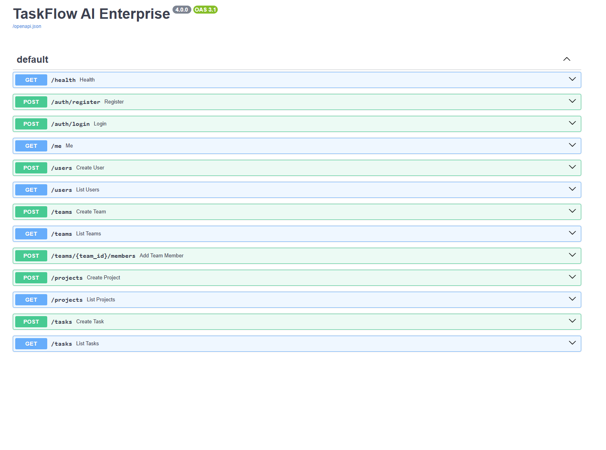
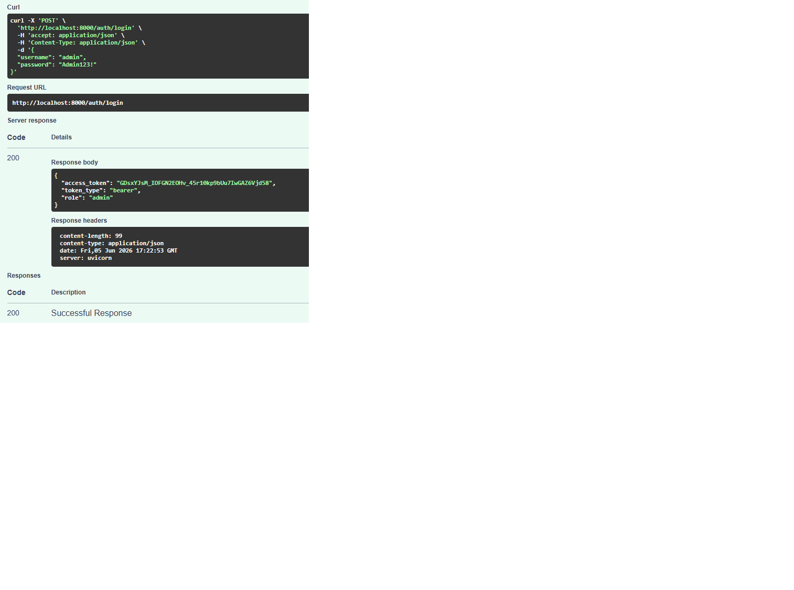
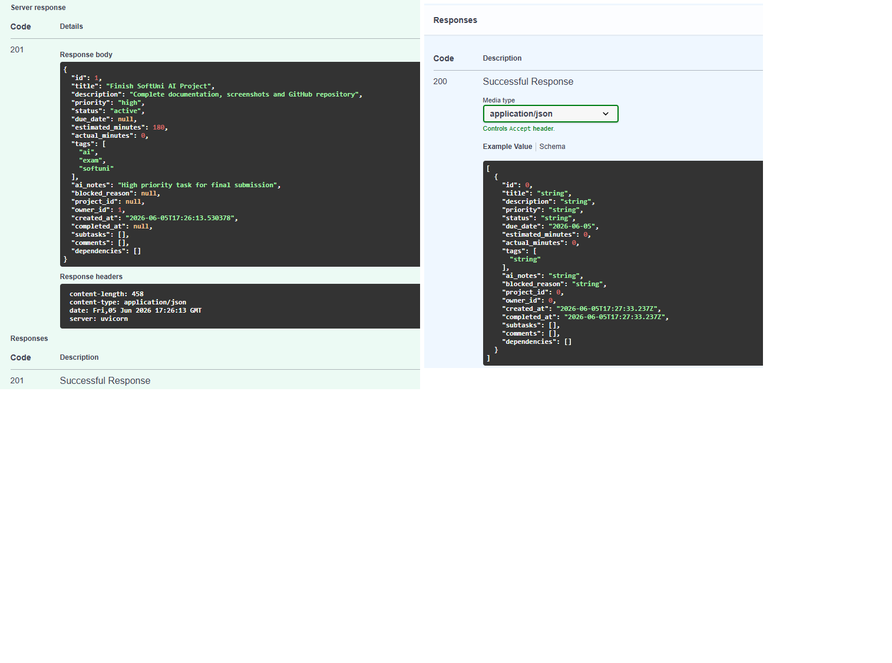
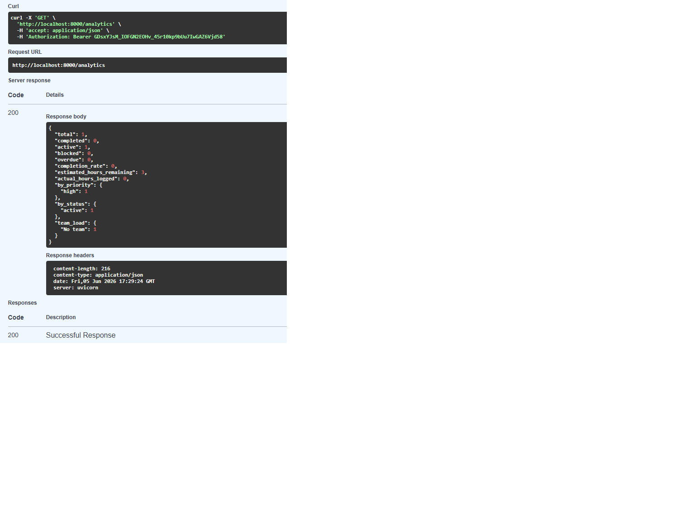
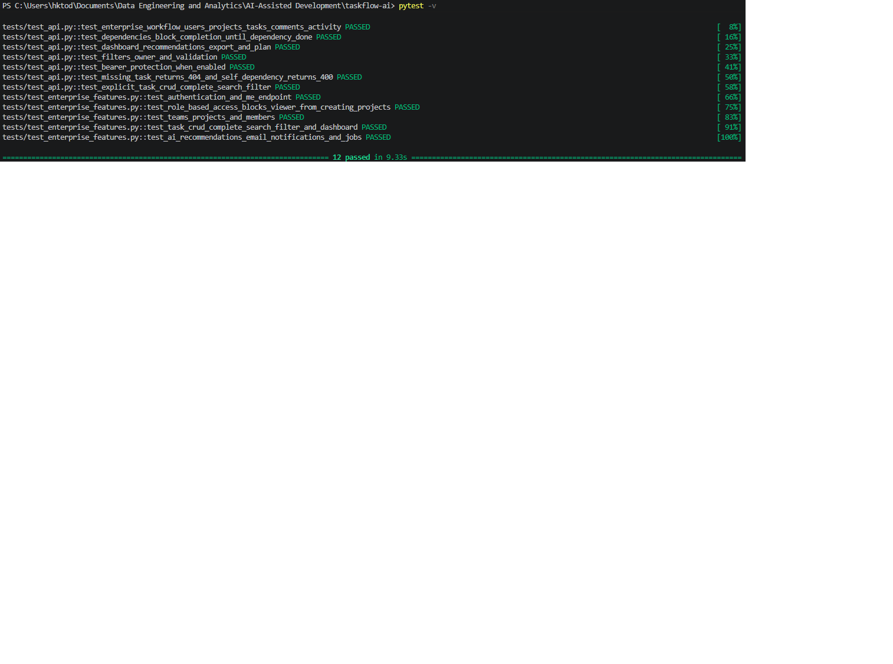

# TaskFlow AI Enterprise – AI-Assisted Development Final Project

TaskFlow AI Enterprise is an advanced AI-assisted task and project management system built with FastAPI, SQLAlchemy, SQLite, CLI tools, analytics, role-based authentication, background jobs and automated tests.

The project was created as a SoftUni AI-Assisted Development exam project and demonstrates modular architecture, AI-assisted implementation, testing, documentation and working system evidence.

## Main Features

- Users with password-based login
- JWT Bearer authentication with expiration
- Role-based access control: `admin`, `member`, `viewer`
- Teams and team members
- Projects connected to teams
- Task CRUD
- Complete task workflow
- Search and filtering by text, status, priority, tag, project and owner
- Subtasks, comments and dependencies
- Analytics dashboard with completion rate, overdue tasks, team load and risk list
- AI-style rule-based recommendations
- Email notification outbox
- Background jobs for queued emails and daily digest jobs
- CSV export
- CLI commands
- Pytest test suite
- GitHub Actions workflow

## Technologies Used

- Python 3.13
- FastAPI
- SQLAlchemy ORM
- Alembic database migrations
- JWT / PyJWT
- pydantic-settings / .env configuration
- SQLite
- Pydantic
- Pytest
- Uvicorn
- REST API
- OpenAPI / Swagger UI

## Architecture

TaskFlow AI Enterprise follows a layered architecture:

```text
Client: Swagger UI / CLI / cURL
        |
FastAPI API Layer
        |
Service Layer
        |
Repository Layer
        |
SQLAlchemy ORM
        |
SQLite Database
```

The API layer handles HTTP requests, the service layer contains business logic, and repositories isolate database access. This structure improves maintainability, scalability and testability.

More details: [`docs/ARCHITECTURE.md`](docs/ARCHITECTURE.md)

## Project Structure

```text
taskflow-ai/
├── app/
│   ├── auth.py
│   ├── cli.py
│   ├── config.py
│   ├── database.py
│   ├── main.py
│   ├── models.py
│   ├── repository.py
│   ├── schemas.py
│   └── service.py
├── docs/
│   ├── AI_ASSISTED_WORKFLOW.md
│   ├── API_EXAMPLES.md
│   ├── ARCHITECTURE.md
│   └── SUBMISSION_CHECKLIST.md
├── alembic/
│   └── versions/
├── screenshots/
├── tests/
├── .github/workflows/tests.yml
├── .env.example
├── alembic.ini
├── Makefile
├── pytest.ini
├── requirements.txt
└── README.md
```

## Installation

```bash
python -m venv .venv
source .venv/bin/activate  # Windows: .venv\Scripts\activate
pip install -r requirements.txt
```

Optional Makefile command:

```bash
make install
```

## Configuration and Database Migrations

```bash
cp .env.example .env
# edit SECRET_KEY and DATABASE_URL before production deployment
alembic upgrade head
```

The API no longer creates database tables automatically at application startup. Use Alembic migrations for schema creation and production-safe upgrades.

## Run API

```bash
uvicorn app.main:app --reload
```

or:

```bash
make run
```

Open Swagger UI:

```text
http://127.0.0.1:8000/docs
```

## Authentication Flow

1. Register a user from `/auth/register`.
2. Login from `/auth/login`.
3. Copy the returned `access_token`.
4. Click **Authorize** in Swagger.
5. Enter: `Bearer <access_token>`.
6. Execute protected endpoints such as `/tasks`, `/analytics`, `/dashboard`.

## Quick API Demo

Register admin:

```bash
curl -X POST http://127.0.0.1:8000/auth/register \
  -H "Content-Type: application/json" \
  -d '{"username":"admin","email":"admin@example.com","password":"secret123","role":"admin"}'
```

Login:

```bash
curl -X POST http://127.0.0.1:8000/auth/login \
  -H "Content-Type: application/json" \
  -d '{"username":"admin","password":"secret123"}'
```

Use the returned token:

```bash
export TOKEN="paste-token-here"
```

Create a task:

```bash
curl -X POST http://127.0.0.1:8000/tasks \
  -H "Authorization: Bearer $TOKEN" \
  -H "Content-Type: application/json" \
  -d '{"title":"Finish SoftUni AI Project","description":"Complete documentation and screenshots","priority":"high","estimated_minutes":180,"tags":["softuni","ai","exam"],"ai_notes":"High-priority final submission task"}'
```

Search and filter:

```bash
curl -H "Authorization: Bearer $TOKEN" "http://127.0.0.1:8000/tasks/search?q=SoftUni"
curl -H "Authorization: Bearer $TOKEN" "http://127.0.0.1:8000/tasks?priority=high&tag=ai"
```

Analytics and AI recommendations:

```bash
curl -H "Authorization: Bearer $TOKEN" http://127.0.0.1:8000/analytics
curl -H "Authorization: Bearer $TOKEN" http://127.0.0.1:8000/dashboard
curl -H "Authorization: Bearer $TOKEN" http://127.0.0.1:8000/ai/recommendations
```

More examples: [`docs/API_EXAMPLES.md`](docs/API_EXAMPLES.md)

## CLI Usage

```bash
python -m app.cli register admin admin@example.com secret123 --role admin
python -m app.cli login admin secret123
export TASKFLOW_TOKEN="paste-token-here"
python -m app.cli team-create "AI Team"
python -m app.cli project-create "Exam Project"
python -m app.cli add-task "Build analytics dashboard" --priority critical --tag analytics --tag api
python -m app.cli search analytics
python -m app.cli analytics
python -m app.cli ai
python -m app.cli email student@example.com Reminder "Finish the project"
python -m app.cli job send_emails
python -m app.cli run-jobs
```

## Screenshots

### Figure 1. Swagger API Documentation



The Swagger/OpenAPI interface provides interactive API documentation and endpoint testing.

### Figure 2. User Authentication



Successful user authentication using Bearer token security.

### Figure 3. Task Management



Task creation with priority, ownership, AI notes, tags, subtasks, comments and dependencies.

### Figure 4. Analytics Dashboard



Analytics and reporting module displaying task statistics and productivity metrics.

### Figure 5. Automated Testing



Pytest automated test suite with all tests successfully passing.

## Run Tests

```bash
pytest -v
```

or:

```bash
make test
```

Latest local result:

```text
12 passed in 1.69s
```

The test suite validates:

- Authentication and login
- Role-based authorization
- Users, teams and projects
- Task CRUD, complete, search and filtering
- Analytics dashboard
- AI recommendations
- Email notifications
- Background jobs

## AI-Assisted Development Evidence

The project demonstrates AI-assisted development through architecture planning, code generation, debugging, test generation and documentation.

More details: [`docs/AI_ASSISTED_WORKFLOW.md`](docs/AI_ASSISTED_WORKFLOW.md)

## Submission Checklist

See [`docs/SUBMISSION_CHECKLIST.md`](docs/SUBMISSION_CHECKLIST.md).

## Future Improvements

Potential future enhancements include:

- JWT authentication
- PostgreSQL support
- Docker deployment
- Kubernetes deployment
- Real email integration
- Machine learning recommendations
- Web frontend with React or Vue
- Real-time notifications via WebSockets
